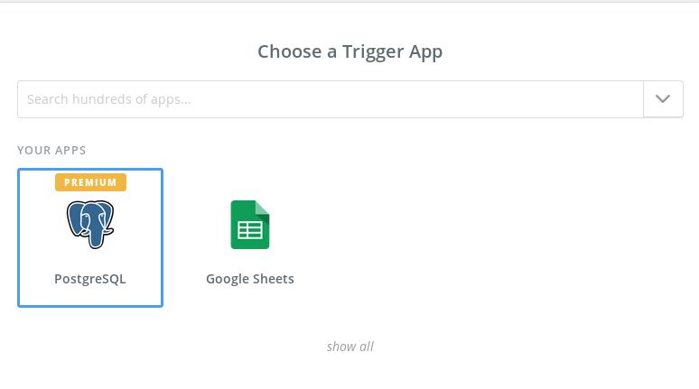
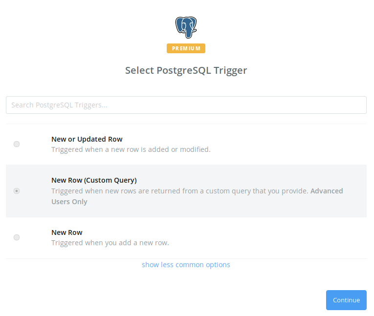
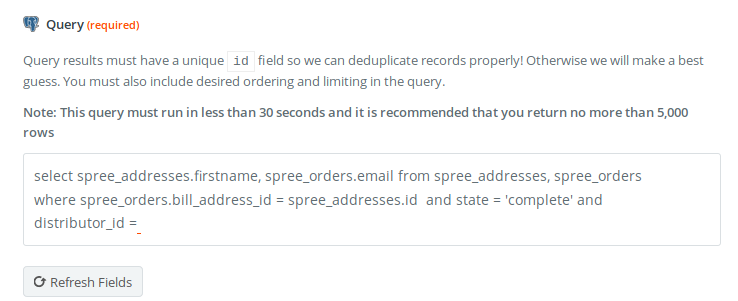
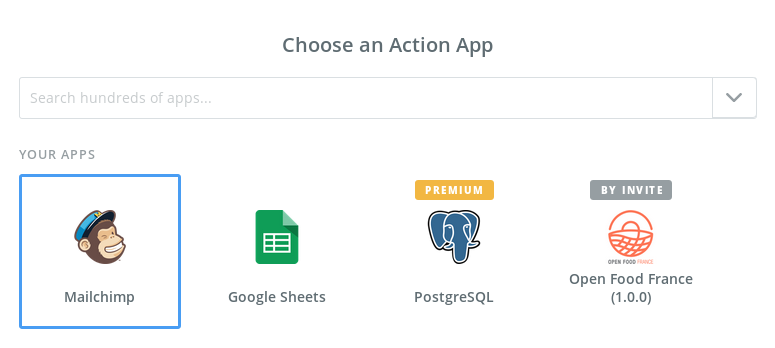
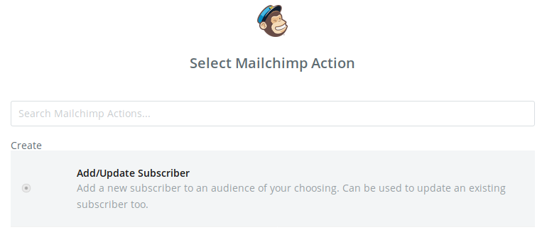
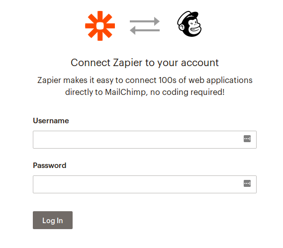

# Integrate OFN with Mailchimp

You might want integrate OFN with Mailchimp for two main reasons:

* You want to propose any new user on your local OFN instance to register to your local newsletter
* Or you want to enable a food hub to integrate their customer list with their own Mailchimp account, so they can manage their newsletter, order cycle mailings, etc. easily.

Today you can use Zapier to establish this kind of integrations. We want to improve it later on with cleaner solution, but for now it does the job !

## Feed any new customer of hub into the Mailchimp audience of that hub

**What you want is :** When there is a new order, you want the name and email of the customer to be added to the Mailchimp audience list of the hub.

### The trigger

* Select as a trigger : PostgreSQL



You want the trigger to be : when an order is made by a new customer in the hub's shop. So for that Zapier will need to read in the OFN database, which is a PostgreSQL type database.

* Then you will choose "new row" as you want to check when there is a new order \(a new row/line in the database in the orders table\) if the customer id is new or not.



* Select the PostgreSQL database you have previously connected


* Then enter the query that will look for the info you want in the database. You can ask on Zappiness Slack channel if you don't know how to do that !



In this case the query is : 

```text
select spree_addresses.firstname, spree_orders.email from spree_addresses, spree_orders where spree_orders.bill_address_id = spree_addresses.id  and state = 'complete' and distributor_id = xxx

```

### The action

What you want now is to describe what you want to happen when the trigger happens. Here, you want that new customer email to be added to the Mailchimp audience of the hub.

* Choose Mailchimp as the app to use in the action section



* Then choose "add/update subscriber



* You are then asked to connect an account, fill in the username and password for the Mailchimp account you want to connect. The user needs to have requested you to make that integration and provide the credentials by any secure media \(phone recommended\).



* \[to be continued\]


