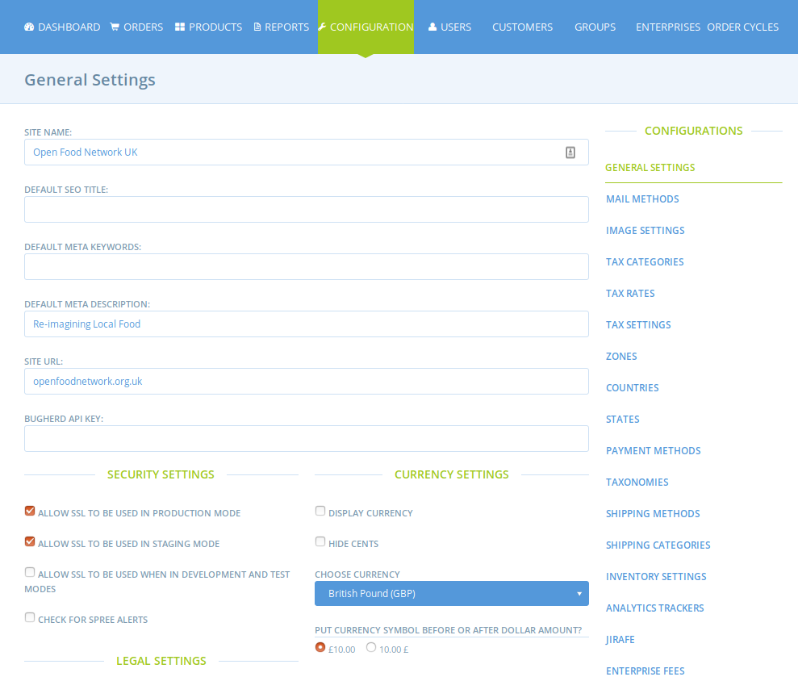

# OFN platform configuration

When you're logged in as super-admin, click on 'configuration' in the top blue menu, you lend in the[ General Setting](https://ofn-user-guide.gitbook.io/ofn-super-admin-guide/ofn-platform-configuration/general-settings) page and can start the configuration !

\#\#Users

You will have a super-admin user. We recommend that you create some Enterprise Users to start setting up, especially if you're setting up Hubs \(read more about Users \[here\]\[5\]. Getting your Users and Enterprises right will save a lot of manual fiddling around later.

e.g.

* Create a User \(click users in the blue menu, then new user\)
  * set their \# of allowed Enterprises to &gt;1 \(e.g. 10\)
  * if you click the 'admin' box, it will give this user super-admin permission. Create some non super admin users.
* Create an Enterprise \(click enterprises, + new enterprise\)
  * Once you have created a users, you can make them the owner of this new enterprise.
  * set type Any to make it a Hub \(read more about \[Enterprise Types\]\[6\]\) and \[how to manage them\]\([http://community.openfoodnetwork.org/t/managing-enterprises/166\](http://community.openfoodnetwork.org/t/managing-enterprises/166%29\)
* Login as that new User
  * now creating additional Producers and Hubs will automatically link these new Enterprises to your first Hub. \[more about auto-E2E-links\]\([http://community.openfoodnetwork.org/t/what-e2e-links-do-new-enterprises-have/33\](http://community.openfoodnetwork.org/t/what-e2e-links-do-new-enterprises-have/33%29\)

\#Keep smiling :-\)

This initial configuration can be a bit painful: you are not yet used to the interface, and there can be some bugs also in this "super admin zone". It's better to prepare the informations you want to put in before entering them \(categories and properties\) to avoid multiple modifications. If you experience a bug, try in another browser, that may work better!

