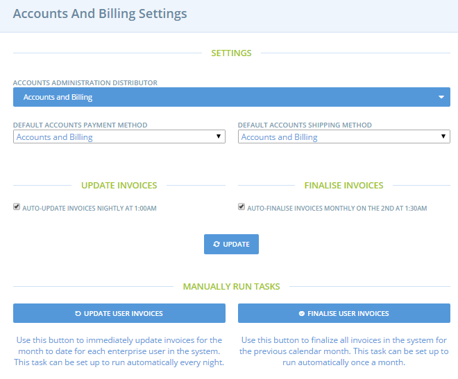
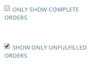

# Accounts & Billing

Accounts and Billing is a tool that instances can use to bill their users.


This super-admin feature was only used by Australian instance and is going to disappear. We are now using zappier to create integrations with invoicing systems.


This tab is where you come to generate invoices for your users. Before you do this, you should set up your fee structure in [Business Model Configuration](business-model.md).

**Accounts Administration Distributor**: This is an enterprise created for the purpose of billing your enterprise users. This enterprise, and it’s owner should be exclusively used for operating the enterprise user billing activities. So firstly create a user and an enterprise \(we called ours Accounts and Billing\). Set this enterprise as a producer selling own, and make it invisible. Then select this enterprise from the list. Once you do this two new fields will open below.

**Default Accounts Payment Method** and **Default Accounts Shipping Method**: Create a payment and shipping method for your Accounts enterprise. These are arbitrary and are just needed to make the enterprise valid.

**Update Invoices**: There is the option to automatically update your invoices each night at 1:00am. If this is selected, when your users go to admin/account they will view an up-to-date figure for what they will be billed for.

**Finalise Invoices**: This option will create invoices at the end of the month. Select this option if you will be billing users on a calendar month basis.

**Manually Run Tasks**: Alternatively to the automated functions above, you can also update user invoices and finalise user invoices manually. When you manually Update Invoices it will only consider orders from the 1st until midnight of the day before. So orders placed on that day won’t be included.

Note: When you manually run tasks, it may take some time to process. You can refresh the page to see if processing is complete.

**Viewing User Invoices \(As SuperAdmin\)**  
To view the invoices login as your Accounts and Billing user, and go to Admin/Orders. Make sure you have selected ‘show only unfulfilled orders’ in the search bar.

**Using Reports to gets final invoice amounts**  
Because invoices have the status ‘in cart’ or are ‘unfulfilled’, until they are finalised, they won’t show in reports until finalised.

Once you have finalised invoices at the end of the month, the orders will be finalised \(no longer ‘in cart’\) so you’ll be able to see them in reports. Click on the ‘Xero Invoices’ and select the report type : Detailed report. Filter the reports for your ‘Accounts and Billing’ enterprise across the relevant dates. Unit amount is the total due for the month.

This report is formatted for import into Xero accounting package.

**Viewing Invoices/Account \(As enterprise User\)**  
Going to [https://openfoodnetwork.org.au/admin/account](https://openfoodnetwork.org.au/admin/account) will take the user to their personal account list. Here they’ll see the balance of their current month, and the previous month’s finalised invoice total, for each of their enterprises.

Note: only the enterprise owner will see the account page - if the user has no account, and they try to access this page they get the error page.

