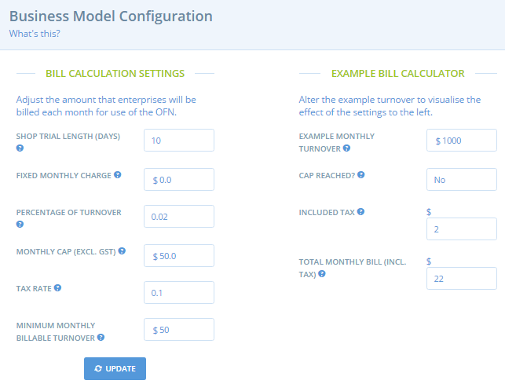
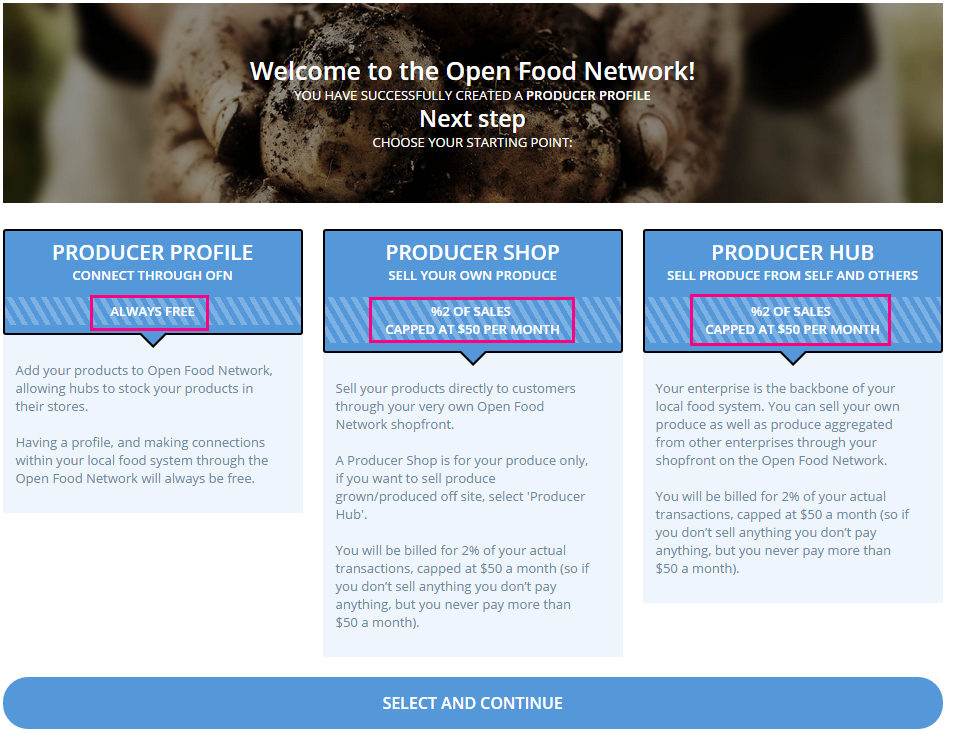
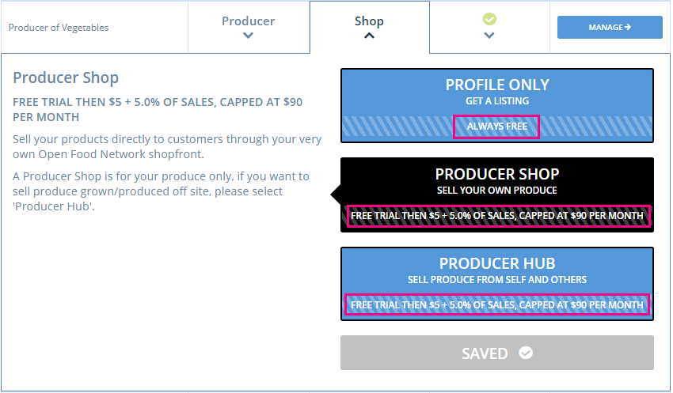

# Business Model

Here you can set up the fee structure that is charged to enterprise users each month, for their use of the Open Food Network.

This fee structure will visible to customers. The actual billing is not automatic, and requires the instance manager to trigger invoices through [Accounts and Billing](accounts-and-billing.md).

The above setup shows a fee structure where users are charged 2% of sales, capped at $50. This excludes GST \(tax\), which is applied at a rate of 10%.

**Shop trial length:** This is the period of time from when the first order is placed in a shop that users won’t be billed for activity.  
**Fixed monthly charge:** This amount will be charged to all users with a shopfront, regardless of the levels of sales they made.  
**Percentage of turnover:** This fee is charged based on a percentage of the sales passed through the shopfront. It excludes tax.  
**Monthly cap \(excl. GST\):** This is a maximum amount charged to a shopfront.  
**Tax Rate:** This is the tax rate that is applied on top of the monthly charge and percentage of turnover.  
**Minimum Monthly Billable Turnover:** This is the threshold above which you will start charging enterprises for use. If a customer’s tax inclusive total turnover for the month is below this, they won’t be billed.

Once you have set up your billing structure, you can trigger invoice creation from [Accounts and Billing](https://community.openfoodnetwork.org/t/enterprise-user-accounts-configuration-accounts-billing/348).

Your Business Model fee structure will be communicated to your users automatically when they select their package and on their enterprises page. See below for examples.

When they first create their profile they'll see this page.

Once they have setup their profile they can change their package at any time, and will see the billing information on the enterprise page.

