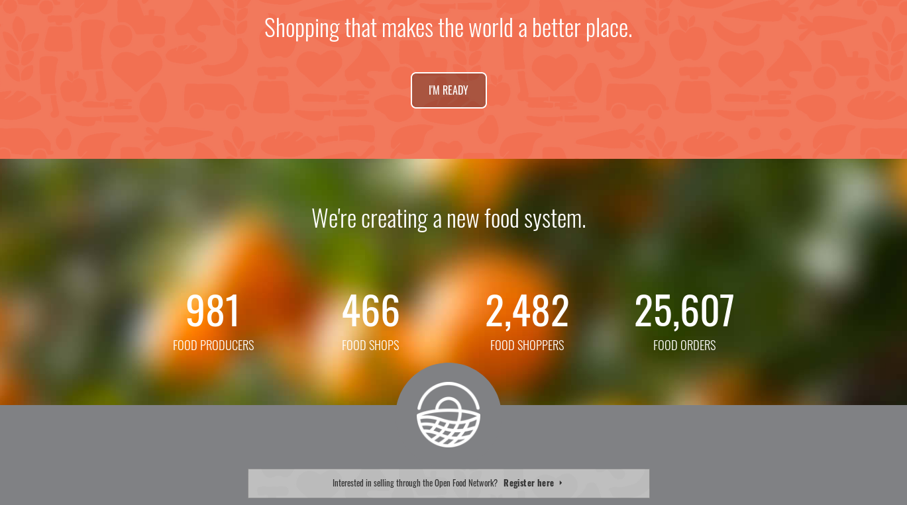
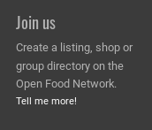
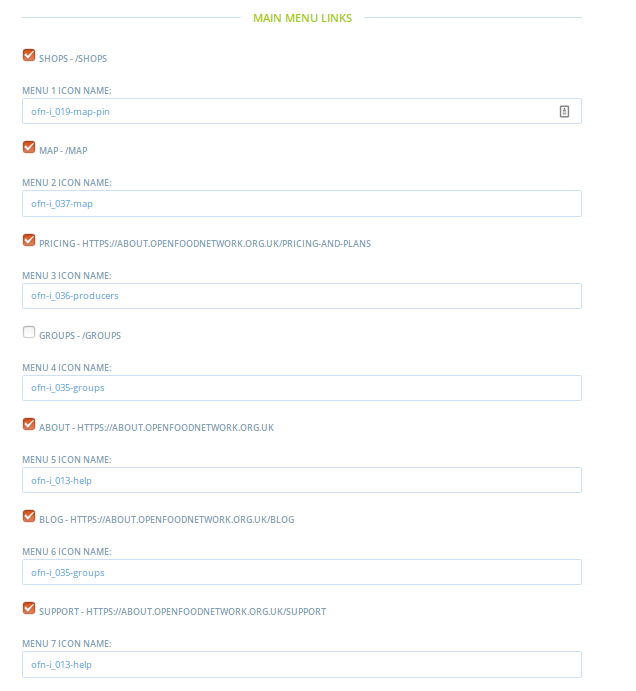

# Content

## Content

This is where you can customize the elements of your instance's appearance and relevant links.

### Header

**Logo\(640 x 130\):** The screenshot below shows where this image will be. It applies on the homepage and also on other pages, including the shops page, producer page, producer sign up page, etc

**Mobile Logo \(72 x 26\):** This image is applied in the same way as the one above, but in the mobile view. It needs to be smaller and with different proportions.

**Mobile Logo \(SVG\):** File type = .svg. Will display in preference to above image in certain situations \(depending on mobile/window size\).

## Home Page

**Hero Image:** 

This image will sit in the background of the homepage. It’s the first image that visitors to the site will see. In the screenshot below, it is the image of the paddock, trees and sunshine.

**Show Statistics:** If you check this box, the homepage will show a live feed of statistics relating to your instance. If unselected, these statistics will not show. See image below of what it will looks like when scrolling the home page.

## Sign-up pages

The following fields relates to the "sell" page accessible from the "Join Us" section in the footer :

_Leaving any of the next 9 fields blank will not remove the section from the pages. The heading will still be there, just without any content below._

### **Producer sign-up page**

**Producer signup pricing table html:** Insert HTML code for the pricing table for producers.  
**Producer signup case studies html:** Insert HTML code for producer case studies.  
**Producer signup detail html:** Insert HTML code for more detail on producer signup.

### **Hub sign-up page**

**Hub signup pricing table html:** Insert HTML code for the pricing table for hubs.  
**Hub signup case studies html:** Insert HTML code for hub case studies.  
**Hub signup detail html:** Insert HTML code for more detail on hub signup.

### **Group sign-up page**

**Group signup pricing table html:** Insert HTML code for the pricing table for groups,  
**Group signup case studies html:** Insert HTML code for group case studies.  
**Group signup detail html:** Insert HTML code for more detail on group signup.

To get some existing html code and copy-paste-adapt it, ask another instance manager ! You can also reuse some infographics, like [this one](https://drive.google.com/open?id=0B_HDFsX1e_2VQUlaTVBPcGVQR3M), that other instances use.

## Main menu links

Here you can select which menu items you want to include in your header menu.

The available menus are sources from Transifex so you need first to make sure you have properly translated them and added the right url \([see relevant paragraph in the translation section](https://ofn-user-guide.gitbook.io/ofn-super-admin-guide/translate-in-your-own-language#some-strings-that-you-need-to-be-careful-about)\).


The translations for those menu in Transifex is different from the other translations, so pay attention ! 


Then, selecting an items turns it visible or invisible.

The name in the field is the name that identify the icons used on the hamburger menu when accessing the platform on a small screen, like a phone. You can ignore them.

## Footer and External Links

The following fields relate to the footer which sits at the bottom of all pages \(pictured below\).

**Logo:** The logo image in the bottom left of the screenshot above.

_If you don’t have accounts with any of the following social media channel, leave the fields blank and no icon or link will appear._  
**Facebook URL:** Should be in this format: [https://www.facebook.com/xxxxxxxx](https://www.facebook.com/xxxxxxxx)  
**Twitter URL:** Should be in this format: [https://twitter.com/xxxxxxxx](https://twitter.com/xxxxxxxx)  
**Instagram URL:** Should be in this format: [http://www.instagram.com/xxxxxx](http://www.instagram.com/xxxxxx)  
**LinkedIn URL:** Should be in this format: [http://www.linkedin.com/xxxxxxx](http://www.linkedin.com/xxxxxxx)  
**Google Plus URL:** Should be in this format: [https://plus.google.com/xxxxxxxxx](https://plus.google.com/xxxxxxxxx)  
**Pintrest URL:** Should be in this format: [https://pinterest.com/xxxxxx](https://pinterest.com/xxxxxx)

**Email:** Place your instance email contact here. This will be inserted into emails generated by OFN \(not the from address, but in the content of the email\)  
**Community Forum URL:** you can customise this with your own discourse forum or other.  
**Links:** You can insert links to other pages, which will show under the ‘email us’, in the Keep in Touch column. E.g. "\[News\]\(https://about.openfoodnetwork.org.uk/blog\)" - this will create a link titled ‘News’, hyperlinked to[https://about.openfoodnetwork.org.uk/blog](https://about.openfoodnetwork.org.uk/blog).   
**About URL:** Link to instance page on .org, or another website \(example : [https://openfoodnetwork.org/ofn-local/open-food-network-australia/](https://openfoodnetwork.org/ofn-local/open-food-network-australia/)\) . There's no place to create an extensive 'about us' page within the instance so when visitor clicks on "about" they will be redirected to that page.

## User guide

Put here the link of your localized user guide. See [dedicated section](https://ofn-user-guide.gitbook.io/ofn-super-admin-guide/set-up-your-user-guide) to learn how to create it !

