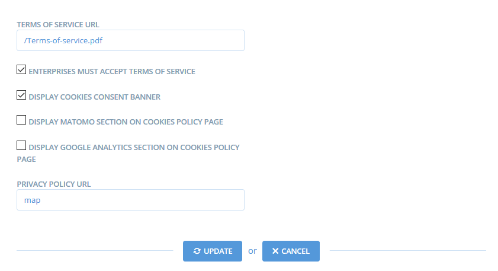

# Matomo settings

[Matomo ](https://matomo.org/)is the analytics tool that we have chosen to implement within OFN as it is fully [GDPR](https://eugdpr.org/) compliant. OFN has a global Matomo account. Just ask on Slack on instance managers channel for someone to give you access to this global account.

As a superadmin, here is what you see in the configuration "Matomo Settings" tab:  

**Matomo URL:** Fill in the following URL [https://openfoodnetwork.innocraft.cloud/](https://openfoodnetwork.innocraft.cloud/)   


**Do not delete the "/" at the end of the URL otherwise it's not working! The URL is the same for ALL instances**


**Matomo Site ID:**  The image below shows where to find this number in the global Matomo account.

If you don't see your instance in the list, you will have to create a new measurable \(red button\). You will see this message:

Click on "Website". You will then have a form that starts like this:

**If you want to set up quickly, here are the info you need to fill:**

**Name**: Indicate the name of your instance e.g. "OFN UK". Remember that all instances have the same access. Putting a clear name will help everyone to know what site is measured.

**URL**: Fill in the URL of you instance e.g. "[https://www.openfoodfrance.org](https://www.openfoodfrance.org)"

**Only track visits and actions when the action URL starts with one of the above URLs**: leave blank

**Keep Page URL fragments when tracking Page URLs**: leave No \(Default\)

**Excluded IPs**: leave blank

**Excluded parameters**: leave blank

**Excluded User agents**: leave blank

**Site search**: leave default site search enabled

**Ecommerce**: set to "ecommerce enabled" and choose the currency of your instance

**Time zone**: indicate the time zone of your instance

Save. Now you have an ID number! Go back to the configuration page to save the info and you are now ready!  
  
Don't forget to check as well "**Display Matomo section on cookies policy page**" in [Configuration &gt; General Settings](https://ofn-user-guide.gitbook.io/ofn-super-admin-guide/ofn-platform-configuration/general-settings).

