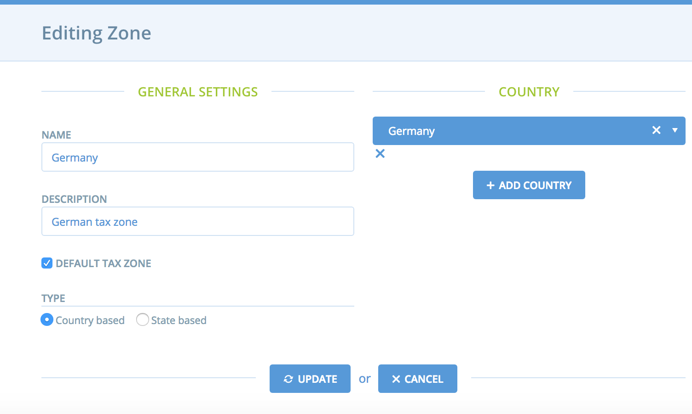
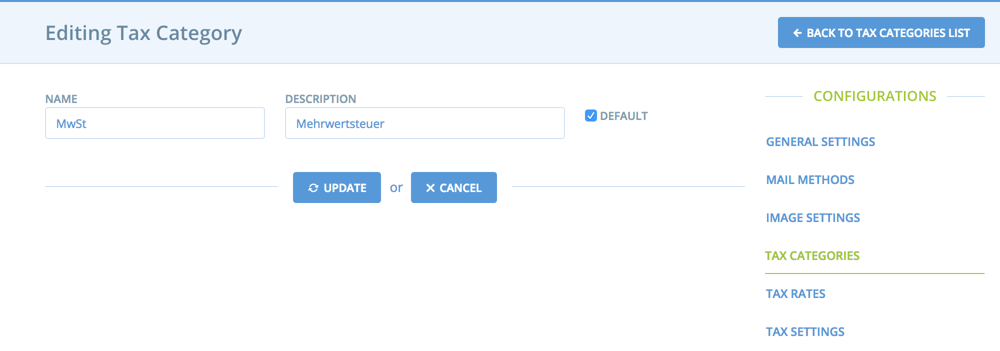
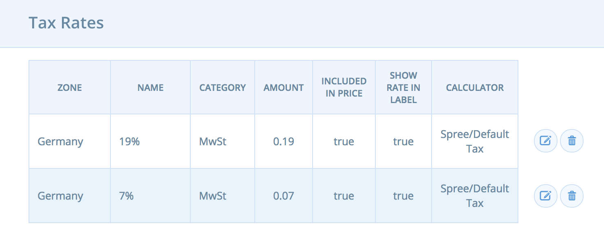

# Taxes and Tax Zones

not yet copied across - see [https://community.openfoodnetwork.org/t/configuration-zones-and-taxes/868](https://community.openfoodnetwork.org/t/configuration-zones-and-taxes/868)

## Taxes and Tax Zones

There are four elements to setting up taxes:

1. Zones
2. Tax Rates
3. Tax Categories
4. Tax Settings

The instructions below have been derived from multiple tax related threads \([748](https://community.openfoodnetwork.org/t/co-budget-and-organization-around-the-tax-overhaul-dev/748), [64](https://community.openfoodnetwork.org/t/how-does-tax-work-vat-and-gst/64), [487](https://community.openfoodnetwork.org/t/outstanding-tax-requirements-jan-2016/487)\) on discourse and the Spree [tax](http://guides.spreecommerce.org/developer/taxation.html) and [zones](http://guides.spreecommerce.org/user/zones.html) guides.

### Zones

What do Zones do? When the customer gets to the final stage of checkout and enters their address, the system checks which zone they are located in. This then dictates which taxes are applied and which Shipping Methods are available.

**Setting up a zone**

**Name: **Name the zone E.g. California, or Australia

**Description: **Give a description E.g. California or Australia

**Default Tax Zone: **By selecting this option, it means that any tax rates applied to this zone will display by default in the shopfront. This will become clearer when you read about Tax Rates and Tax Categories below. For example, if you have a Country wide tax and a variable State tax system, you may want the Country tax to show by default \(as it’s charged to everyone\) but the State tax will only be applied once the customer provides their address and the relevant state tax is applied. If you were to have the California tax show as default, it would confuse customers from others states when that tax was replaced with their state tax, so choose the default tax accordingly.

**Type: **Country based or State based. Zones are defined at two levels; country and state. You cannot setup zones for postcodes/zip codes, states are the finest zone available. Select if you’re setting up a country zone, or a state zone.

**Country/States: **Now select the country\(ies\)/state\(s\) that fall into this zone. For Australia, we just have a single country in the Australia zone. For Europe, you may have multiple countries in the one zone E.g. EU.

**How Zones interact with Shipping Methods**

Every shipping method is configured to apply to a ‘zone’. \(see below\)

If a shipping method is set to the Country level zone, the shipping method will be available to all customers in that country. If the shipping method is set to a State level zone, it will only be available to customers located in the corresponding state. Thus, you should setup zones according to how users may want define the availability of their shipping methods.

**How zones interact with Tax**

The system will apply taxes according to which Zone the customer is located in. Every Tax Rate is set to apply to a zone, as will be described below.

**National tax rates** - taxes applied at the same rate across a country will be set to a country based zone.  
**State taxes** - taxes applied at a state level will be set to a state based zone.

Note: If the shipping method is a ‘collection’ method, the tax is based on the location of the shop. If the shipping method is a ‘delivery’ method, the tax will show according to the location of the customer \(their shipping address\).

### Tax Rates

Tax rates are where you setup the % tax rates that are relevant in your instance. Below is an example tax rate, it is Australia’s nationwide tax.

**Name: **What is the name of the tax?

**Rate: **What % is the tax? This is defined as a decimal e.g. 10% = 0.10

**Included in Price: **If product prices should display to the enterprise manager and to the customer as the ‘tax inclusive price’, click this tick box. If customers and enterprise managers prefer to see the ‘tax exclusive price’ and then see the tax added on at checkout, deselect this option. Note; tax inclusivity/exclusivity is defined at the instance level. Users can’t choose individually whether their shops display tax inclusive or exclusive prices.

**Zone: **Each tax rate has a defined zone \(see Zone section above\). This dictates which customers the tax applies to. If it’s a national tax, it will apply to all customers in the country based zone. If it’s a state tax, it will only apply to customers located in that state. Note, you’ll need to have your zones setup before you can setup your tax rates.

**Tax Category: **Each tax rate sits in a defined Tax Category \(see Tax Category section below\). The Tax Category is the label seen by the enterprise user when they apply tax rates to products. If a Tax Rate isn’t in a category it can’t be applied.

**Show rate in label: **???

**Calculator**: Leave this as Default Tax

### Tax Categories

Tax Categories, rather that tax rates are applied to products. When enterprise users create a product in the system, they’ll apply a Tax Category to the product.

Why do we apply Tax Categories to products rather than tax rates? This is because Tax Categories can encompass multiple Tax Rates. For example, a country may charge tax on Vegetables differently in every state. In this case, the instance will setup a Tax Category called ‘State Tax’, which will be applied to vegetables. The instance will setup a Tax Rate for each state and assign these Tax Rates to the State Tax Category. The result of this configuration is that when a customer buys vegetables, the system will see which state they are located in, and then apply the relevant state Tax Rate within the category.

While Tax Categories \_can \_encompass multiple tax rates, they don’t have to. In some cases, the Tax Category will contain a single Tax Rate. The Australia wide tax is an example of this, there is only one Tax Rate in the Cateogory and it applied to the Australia Zone. You may also house your State Tax rates in individual Tax Categories, rather than having a single Category housing all state taxes.

**The setup of a Tax Category**

Tax Categories are simply setup with a name and a description. Putting tax rates into tax categories is done in Tax Rates.

There is also the option of setting a Tax Category as default. If your instance has a Tax Category set as default, that Tax Category will be applied to all products where no other tax category is defined. So by default all products will carry this tax category. Otherwise products will be tax free by default.

### Tax Settings

For some reason the tax applied on Shipping fees is set at the instance level, in Tax Settings. You can select if the shipping fee is displayed inclusive or exclusive of tax. And the rate is set as a decimal 10%= 0.10

#### Example Settings

Below is an example of the Settings for the German instance.

Create new zone Germany and make it default tax zone 

Create category for VAT, also make default.

Create two new tax rates for general and reduced German VAT rates as per [http://www.gtai.de/GTAI/Navigation/EN/Invest/Investment-guide/The-tax-system/value-added-tax-vat.html](http://www.gtai.de/GTAI/Navigation/EN/Invest/Investment-guide/The-tax-system/value-added-tax-vat.html)

Select 'include in price' - annoying for people not to see tax included prices when they are shopping

Tax Settings - Myriam to check with Germany

