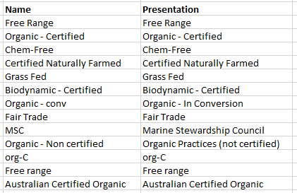

# Producer and Product Properties

'Properties' refers to classifications such as 'free -range', 'organic' and 'local'. In OFN there is the option to assign properties to products and/or producers. If a property is applied to a producer, it automatically applies to all products, but you can change them within the product properties menu. When the customer is browsing the OFN directory and shops they can filter according to these properties.

Each instance can setup their own list of properties. The properties that are available on the Australian instance are shown below as an example

## Setting properties for your instance

Go to Products on the horizontal blue menu, and then select Properties in the green horizontal menu.

_Note: if you're wondering what the 'Option Types', and'Prototypes' tabs are, you can ignore these, they are remnant Spree tabs._

Use the **+ New Property** button to add properties.


BE CAREFUL: on the product page, when you add properties to a product through your super-admin account, you are not limited to the existing list of properties, you have to start typing for a suggestion to appear, and you are not blocked if you write a new property, which will be added to the whole properties list... **so there is a high risk of creating duplicates, that then will be proposed in the general list and generate confusion**! So the easiest way to avoid mistakes is to always use a regular "user account" when working on tasks related to hubs and products administration. Don't add products with properties when using your super-admin account.


